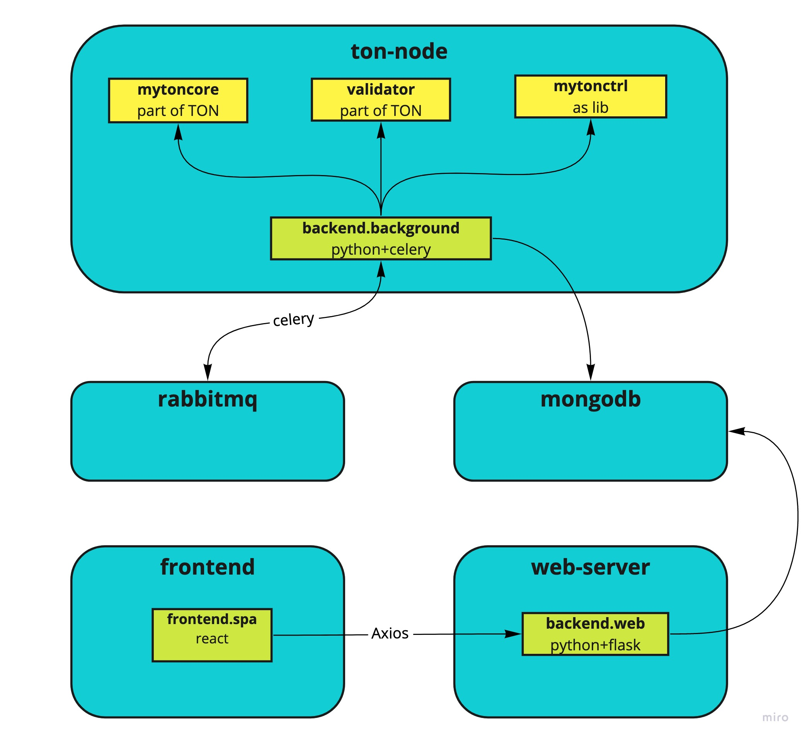

# TON Monitor
Service for monitoring TON Network status.

## Architecture

The service consists of 5 parts:
* **Full TON node.** It collects following TON network statistics using MyTonCtrl wrapper: 
    * Blocks, 
    * Transactions, 
    * Lite Servers' availability and sync state, 
    * TON services response time and availability
    * Operability of BSC and ETH bridges
    * Governance info
    * Validators data
Tasks for fetching the data are triggered by Celery. Collected data is stored in MongoDB database.
* **RabbitMQ.** Messaging protocol for Celery.
* **MongoDB.** Database with all collected data.
* **Webserver.** Webserver has multiple endpoints. At every endpoint it responds with fetched and aggregated data from MongoDB.
* **Frontend.** Frontend is written with ReactJS framework. It makes requests to Webserver and presents data to users.

Each part is represented by Docker container.

## Deploy with Docker Compose
Just run `docker-compose up -d --build`. On updates run `docker-compose build <service> && docker-compose up -d <service>`.

## Manual run
### Running Celery
1. Set `export PYTHONPATH=/usr/src/mytonctrl`.
2. Run `celery -A backend.background.celery worker --loglevel="INFO"`.

### Running Flask
1. Set `export PYTHONPATH=/usr/src/mytonctrl`.
2. Run `./run_web_server.py`.

### Running MongoDB and RabbitMQ
Best practice is to run them from docker-compose. It will correctly mount data volumes and bind ports.
1. Run `sudo docker-compose up -d mongodb`.
2. Run `sudo docker-compose up -d rabbitmq`.
